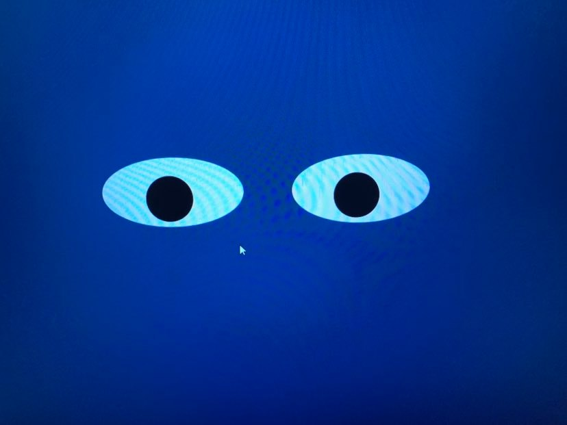

# Eye-Exercise
Moving the eyes by the mouse direction.

**Project Title:** Eye-Movement

<a href="https://keoyoulong.github.io/">Move Back to Home</a>
<button width="65"><a href="https://github.com/keoyoulong?tab=repositories"
    style="text-decoration:none">Link to All Repository page</a></button>
      

When mouse moving, the eyes will move to the direction of the mouse move.

To Run the project, have to download or close all files in the repository to your local machine in the same directory. Then run the index.html file on your broswer. Finally move your mouse to the eyes movement accordingly.

For future improvement, when the eyes move many times i would have the eyse having some tear running down the eyes showing the tiredness of the eyes.

License Information: should refer to MIT license file.
